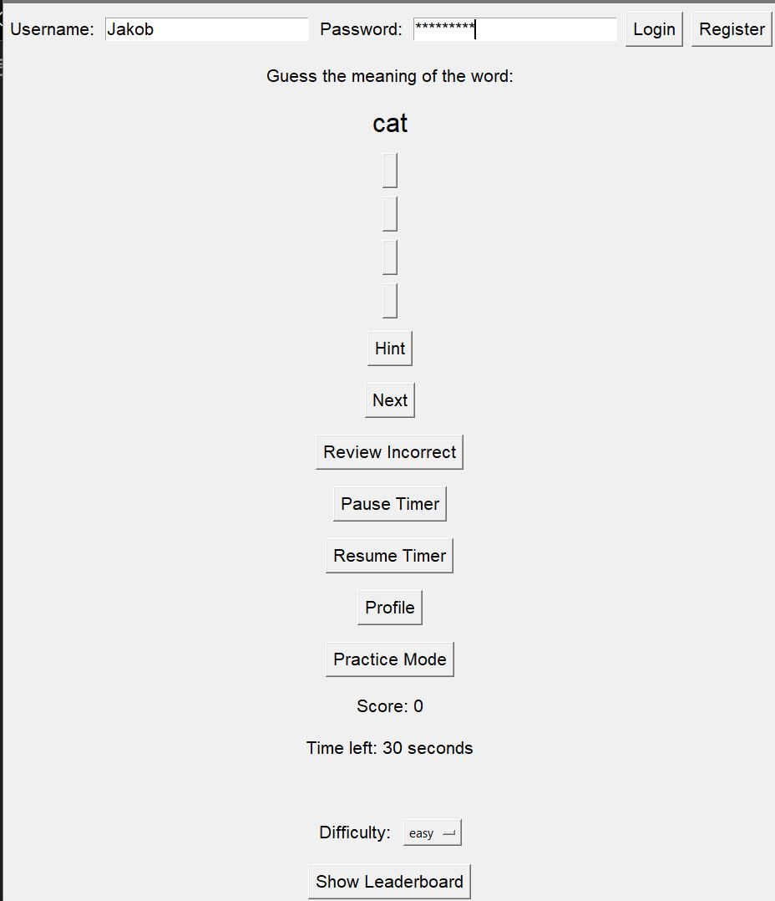

# Vocabulary Learning App

This is a Vocabulary Learning App built with Python and Tkinter. The app helps users learn new words by presenting them with words and multiple-choice meanings. Users can log in, track their progress, and review their incorrect answers.

## Features

- **User Authentication**: Register and log in with a username and password.
- **Difficulty Levels**: Choose from easy, medium, and hard word lists.
- **Multiple Choice**: Select the correct meaning from four options.
- **Hints**: Get a hint by showing the first letter of the correct meaning.
- **Profile**: View your profile with statistics like score, correct answers, and accuracy.
- **Practice Mode**: Practice without a timer or scoring.
- **Review Incorrect**: Review words that were previously answered incorrectly.
- **Leaderboard**: See the top scores on the leaderboard.
- **Timer**: Answer questions within a 30-second time limit (can be paused and resumed).

## Requirements

- Python 3.x
- Tkinter (usually included with Python installations)
- No external libraries are needed.

## Installation

1. Clone this repository or download the source code.

    ```bash
    git clone https://github.com/yourusername/vocabulary-learning-app.git
    cd vocabulary-learning-app
    ```

2. (Optional) Create a virtual environment and activate it.

    ```bash
    python -m venv venv
    source venv/bin/activate  # On Windows: venv\Scripts\activate
    ```

3. Run the application.

    ```bash
    python app.py
    ```
    
